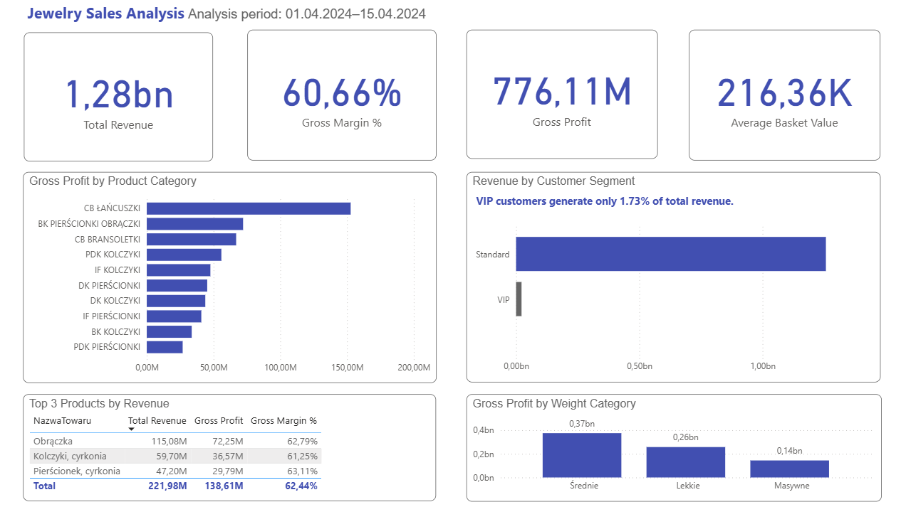

# Jewelry Sales & Profitability Analysis
Sales and profitability analysis of a jewelry retailer using SQL and Power BI.

## Project Overview

This project analyzes transactional sales data from a jewelry retailer to evaluate revenue, profitability, customer behavior, discount impact, and product performance.

The goal was not only to calculate sales KPIs, but also to answer practical business questions related to assortment management, pricing, discounts, and customer segmentation.

The analysis was performed using SQL for data exploration and business analysis and Power BI for KPI calculation and dashboard visualization.

Analysis period: 01 Apr 2024 – 15 Apr 2024

> The dataset represents a short transactional snapshot, therefore the project focuses on sales structure and profitability rather than long-term trends or seasonality.

---

## Tools & Technologies

- SQL
- Power BI
- DAX
- Data Modeling
- Data Visualization
- Business Analysis

### SQL techniques used

- JOIN
- GROUP BY
- CASE
- CTE
- DENSE_RANK()
- PARTITION BY
- Window Functions
- Cumulative SUM()
- COALESCE()
- NULLIF()
- COUNT DISTINCT

---

## Executive Dashboard

The Power BI dashboard provides a high-level overview of revenue, profitability, customer segments, product categories, and product performance.



### Main KPIs

| KPI | Result |
|---|---:|
| Total Revenue | 1.28B PLN |
| Gross Profit | 776.11M PLN |
| Gross Margin | 60.66% |
| Average Basket Value | 216.36K PLN |

---

# Business Questions

## 1. Discount Impact on Revenue & Margin

### Business Question

Do discounted transactions generate enough additional revenue to compensate for lower gross margins?

The analysis groups transactions into discount levels and compares:

- number of transactions;
- average basket value;
- total revenue;
- gross profit;
- gross margin.

The discount groups were created using `CASE`.

```sql
CASE
    WHEN LacznyRabat = 0 THEN '01. No discount (0%)'
    WHEN LacznyRabat <= 10 THEN '02. Low discount (1-10%)'
    WHEN LacznyRabat <= 25 THEN '03. Medium discount (11-25%)'
    ELSE '04. High discount (>25%)'
END AS DiscountLevel
```
